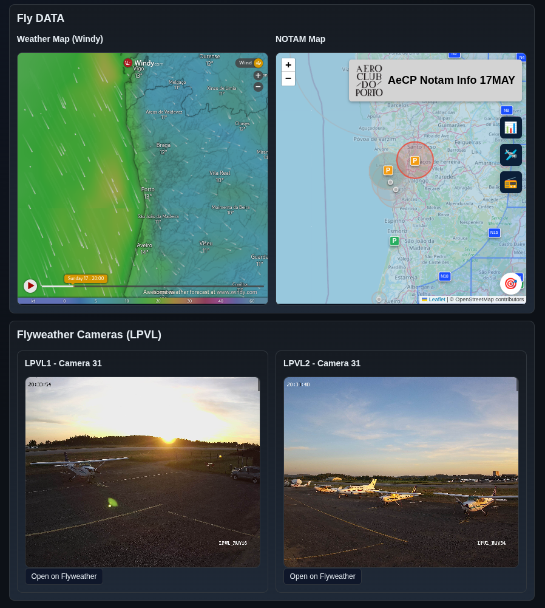
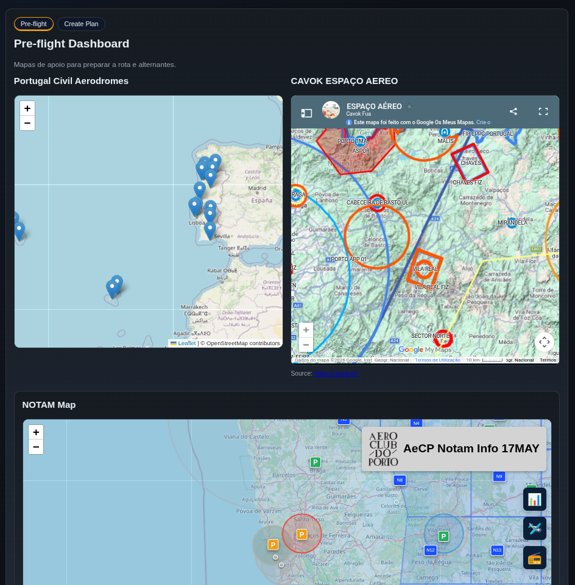
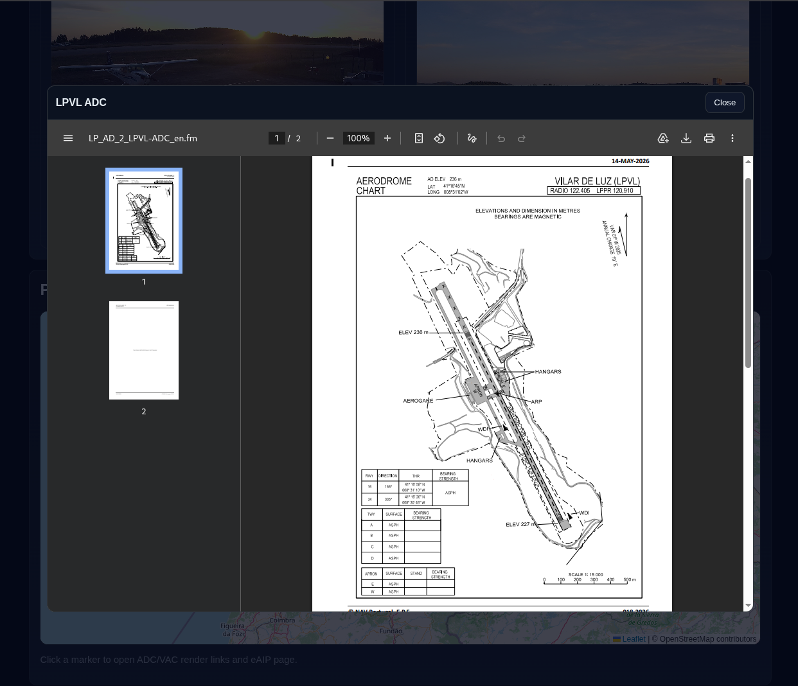
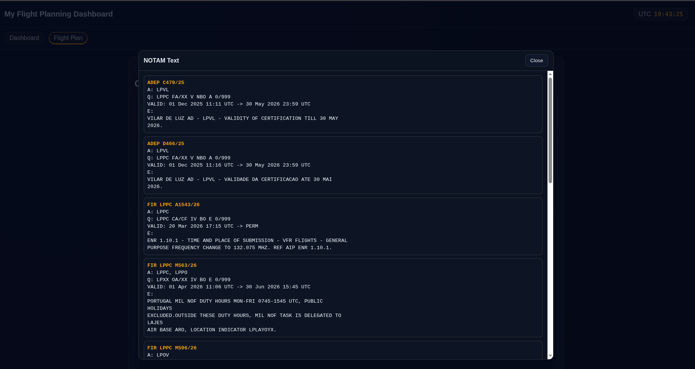

# MyflyApp

Disponível em [myflyapp.vercel.app](https://myflyapp.vercel.app)

## Features

- **METAR / TAF** — dados meteorológicos em tempo real via proxy server-side (aviationweather.gov)
- **Mapa meteorológico** — mapa interactivo tipo Windy centrado em Portugal
- **NOTAMs** — visualizador de NOTAMs integrado com filtro de rota via fplbriefing.nav.pt
- **Flight Plan** — consulta de PIB (Pre-flight Information Bulletin) por rota
- **Navegações** — criação de rotas entre aeródromos, breaking points, alternante, referências visuais e E6B rápido
- **Simulação de rota** — avião animado no mapa com Play/Pausa, velocidades configuráveis e orientação por breaking point ou destino final
- **Instrumentos em tempo real** — HSI, RMI e indicador VOR sincronizados com a posição simulada; o avião pode ser arrastado para avançar ou recuar no percurso
- **Laboratório de instrumentos** — estudo manual de HSI, RMI e VOR com exemplos aleatórios preenchidos em cada carregamento
- **PDF de navegação** — exportação da rota, pernas, alternante, referências e cálculos de apoio
- **Massa & Balanceamento** — cálculo de peso, momento e envelope de CG para as aeronaves configuradas
- **Categoria de voo** — indicador VFR / MVFR / IFR / LIFR calculado automaticamente
- **Relógio UTC** — sincronizado em tempo real
- **Single Page App** — navegação por tabs sem recarregar a página

## Simulador e instrumentos

1. Em **Navegações**, seleciona os aeródromos e cria uma rota.
2. Adiciona breaking points ou referências, se necessário, e escolhe **Simular**.
3. Usa **Play/Pausa** ou arrasta diretamente o avião ao longo da rota para estudar a indicação do HSI, RMI e VOR em qualquer ponto.
4. No fundo da página, altera manualmente rumo, curso, bearings, CDI e TO/FROM no laboratório de instrumentos.

O simulador e os instrumentos são demonstrações educativas simplificadas. Não substituem cartas oficiais, AIP/eAIP, NOTAM, briefing operacional, instrumentos certificados ou treino de voo.

## Stack

Python · Flask · Vercel (serverless) · Vanilla JS

---

## Screenshots

O objetivo foi reunir o máximo de informação de diversas fontes num único lugar.

---

Foi também integrada informação que vai buscar as cartas oficiais ao NAV Portugal. Os mesmos podem estar desatualizados.

---

Na versão local é possível ir automaticamente buscar o Narrow Route NOTAM via fplbriefing.nav.pt.

