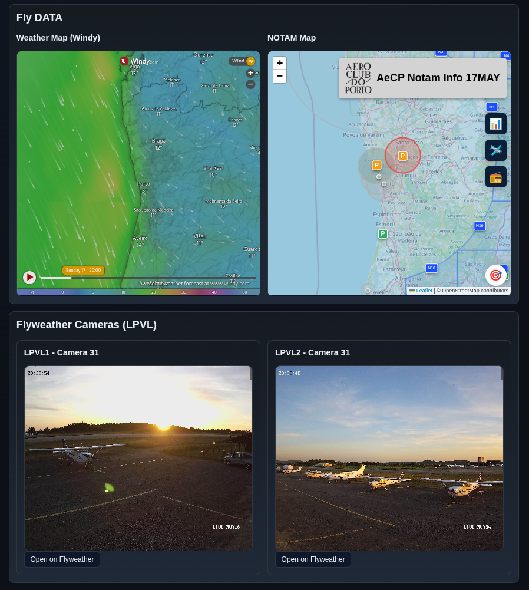
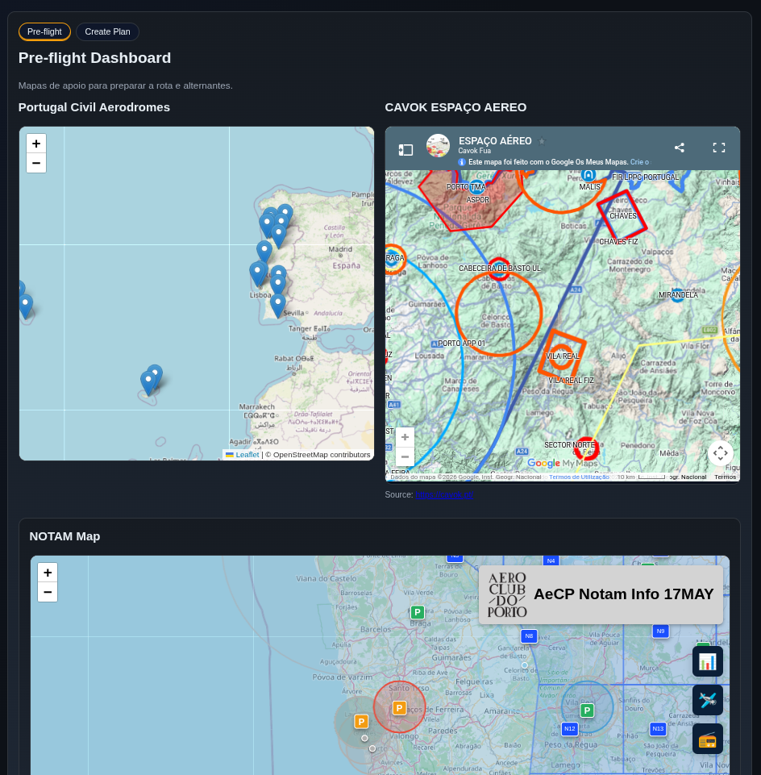
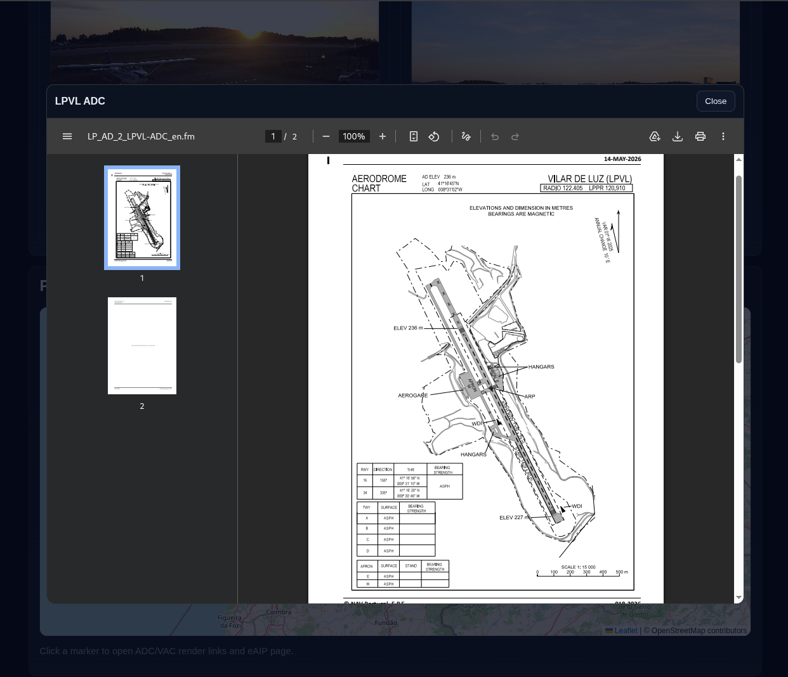
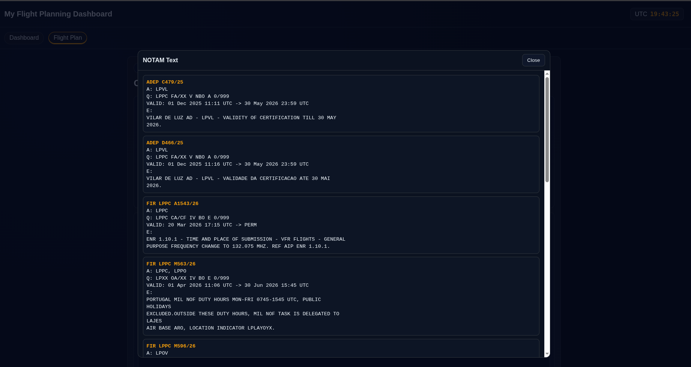

# MyFlyApp

Dashboard Flask/Vercel para apoio ao planeamento e estudo de aviação geral/PPL em Portugal.

Produção: [myflyapp.vercel.app](https://myflyapp.vercel.app)
Repositório: [github.com/JoseAbreu28/myflyapp](https://github.com/JoseAbreu28/myflyapp)

> O MyFlyApp é uma ferramenta educativa e de apoio ao planeamento. Não substitui cartas oficiais, AIP/eAIP, NOTAM atuais, briefing operacional, instrumentos certificados, treino aprovado ou a responsabilidade do piloto.

## Começar localmente

Requisitos: Python 3.12 e acesso à rede para mapas e serviços externos.

```powershell
python -m venv .venv
.\.venv\Scripts\Activate.ps1
python -m pip install -r requirements.txt
python app.py
```

Abrir <http://127.0.0.1:5000/>.

## O que o site contém

### Dashboard

- METAR/TAF e categoria VFR/MVFR/IFR/LIFR para aeródromos selecionáveis.
- Quadro de frequências e relógio UTC.
- Windy, mapa NOTAM e câmaras Flyweather com fallback para links externos.
- Mapa de aeródromos civis com acesso às cartas ADC/VAC e eAIP/NAV Portugal.

### Plano de voo

- **Pré-voo:** mapas e fontes de apoio.
- **Criar plano:** formulário local, alternante e consulta opcional de Narrow Route PIB.
- **Navegações:** rota entre aeródromos, breaking points, referências, E6B, simulação com HSI/RMI/VOR e exportação PDF.
- **Massa & Balanceamento:** peso, momento, CG e envelope para as aeronaves configuradas.

### Treino

- **Instrumentos:** treinador VOR Porto/Viseu (`PRT 114.10` e `VIS 113.10`) com mapa, avião arrastável, OBS, CDI e TO/FROM.
- **Avionics Simulator / Setup 1:** dois G5 e GNS 430/430W, navegação GPS/VLOC, OBS, Direct-to e cinco níveis, incluindo a GNS 430 **Map Page**.
- **Avionics Simulator / Setup 2:** GI-106A + GNC 255 com quatro níveis VFR de identificação, TO, FROM e mudança de estação.
- **Checklist de desafios:** confirmação automática/manual dos 9 níveis de aviónica, apenas na sessão atual do browser.

## Documentação completa

O guia operacional e técnico está em [docs/site-guide.md](docs/site-guide.md). Inclui:

- utilização detalhada de cada tab e subtab;
- fluxo dos simuladores e critérios dos níveis;
- endpoints Flask e integrações externas;
- estrutura do repositório, configuração e deploy Vercel;
- segurança, privacidade, limites aeronáuticos e checklist de release.

## Stack e estrutura

Python + Flask + requests + Vercel + Jinja + JavaScript/CSS vanilla + Leaflet CDN. Não existe base de dados nem build step frontend.

```text
app.py                          Flask, APIs, proxies e PDF
config.py                       Configuração e URLs externas
api/index.py                    Entrada WSGI do Vercel
templates/                      Shell e markup da SPA
static/css/style.css            Tema e layout responsivo
static/js/app.js                Tabs, dashboard e inicialização
static/js/navigation.js         Rotas, E6B, simulação, i18n e PDF
static/js/vor-trainer.js        Treinador VOR
static/js/avionics-simulator.js Simulador G5/GNS/GI-106A/GNC 255
static/js/massbalance.js        Massa, balanceamento e CG
docs/                           Documentação e planos históricos
```

## APIs principais

| Método | Endpoint | Uso |
| --- | --- | --- |
| `GET` | `/api/metar/<icao>` | METAR normalizado com cache curto. |
| `GET` | `/api/taf/<icao>` | TAF normalizado com cache curto. |
| `POST` | `/api/navigation/pdf` | PDF da rota, E6B, alternante e referências. |
| `POST` | `/api/fplbriefing/narrow-pib` | Proxy de PIB com token fornecido apenas no pedido. |
| `POST` | `/api/fplbriefing/route-map` | GeoJSON de rota do fplbriefing. |

## Verificação

```powershell
python -c "import app; print('import OK')"
node --check static/js/app.js
node --check static/js/navigation.js
node --check static/js/avionics-simulator.js
git diff --check
```

Testar também as tabs, os dois setups da aviónica, PT/EN, viewport móvel e os estados indisponíveis dos serviços externos.

## Screenshots








